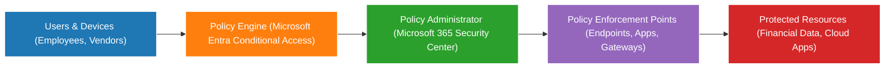
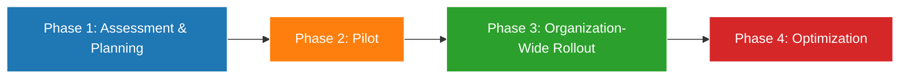

# Zero Trust Security Framework (Preview)
**Author:** Audie Williams  
**Project Type:** Graduate Capstone – WGU MSCSIA (D490)  
**Framework:** NIST SP 800‑207  
**Environment:** Microsoft 365 Cloud  

© 2025 Audie Williams. All rights reserved.  
*This is a **preview** of a comprehensive Zero Trust Security Framework developed for Greenleaf Financial Services LLC. The full document is available upon request.*  

---

## Overview
This project presents a **Zero Trust Security Framework** designed for Greenleaf Financial Services LLC, a mid-sized financial organization.  
It was developed as part of my **Master of Science in Cybersecurity & Information Assurance Capstone** to address modern cybersecurity challenges by implementing a **NIST SP 800‑207 aligned Zero Trust model** in a **Microsoft 365 environment**.

**Full framework details, including technical controls and implementation steps, are not included in this preview.**

---

## Key Highlights
- **Zero Trust Design:** Implemented **Policy Engine, Policy Administrator, and Enforcement Points** per NIST SP 800‑207.  
- **Identity & Access Management:** Multi-Factor Authentication (MFA) and **Role-Based Access Control (RBAC)** using Microsoft Entra ID.  
- **Network Segmentation:** Applied **Zero Trust Network Access (ZTNA)** to protect critical systems.  
- **Continuous Monitoring:** Integrated **Microsoft Sentinel** for real-time logging, alerting, and threat detection.  
- **Data Protection:** Enforced **Data Loss Prevention (DLP)** and encryption for sensitive financial data.  

---

## Executive Summary
Greenleaf Financial Services LLC faced challenges securing cloud assets, remote workers, and sensitive customer data.  
To address these, this framework introduces a **Zero Trust approach** that shifts security from perimeter-based controls to **identity-centric, context-aware access policies**.

**Core Objectives:**
- Enforce **least privilege** and **just-in-time access** across systems.  
- Protect financial and personal data with encryption and DLP.  
- Strengthen compliance with **PCI DSS** and **GLBA** requirements.  
- Improve visibility and response with **continuous monitoring and SIEM integration**.  

This solution **aligns business objectives with a modern security posture**, enhancing Greenleaf’s resilience against evolving threats.

---

## Architecture
Below is a conceptual view of the framework architecture, showing how users interact with resources through Zero Trust policy controls.

## Implementation Roadmap
A **phased approach** ensures minimal disruption while achieving quick wins.

### **Phase 1: Assessment & Planning**
- Risk assessment and asset inventory  
- Mapping data flows and critical applications  

### **Phase 2: Pilot**
- Rollout of **MFA** and **RBAC** for critical systems  
- Baseline **Conditional Access** policies  

### **Phase 3: Organization-Wide Rollout**
- Expansion of Zero Trust policies to all users/devices  
- Deployment of **Microsoft Defender for Endpoint**  

### **Phase 4: Optimization**
- Continuous policy tuning  
- **Advanced analytics** with Microsoft Sentinel  

---

## Skills Demonstrated
- **Cloud Security:** Microsoft 365, Entra, Defender, Sentinel  
- **Zero Trust Architecture:** NIST SP 800‑207 principles  
- **Identity & Access Management:** MFA, RBAC, Conditional Access  
- **Security Operations:** SIEM integration, real-time monitoring, incident response alignment  
- **Regulatory Compliance:** PCI DSS, GLBA strategies  
- **Technical Communication:** Executive-level & technical documentation  

---

## What’s Included in This Preview
- Executive Summary of the framework  
- Architecture & Implementation Roadmap visuals  
- High-level project objectives and outcomes  

**Full documentation** (detailed technical controls, configuration steps, and appendices) is **available upon request** for hiring managers and academic reviewers.

---

## References
- National Institute of Standards and Technology. (2020). *Zero Trust Architecture (SP 800‑207).*  
- Microsoft. *Zero Trust Deployment Guide.*  
- PCI DSS, GLBA, and related financial compliance guidelines.

---

## License
© 2025 Audie Williams.  
This work is licensed under the **Creative Commons Attribution-NonCommercial 4.0 International License**.  
You may view and share this work for non-commercial purposes with attribution.  
[Read the full license here](https://creativecommons.org/licenses/by-nc/4.0/).
